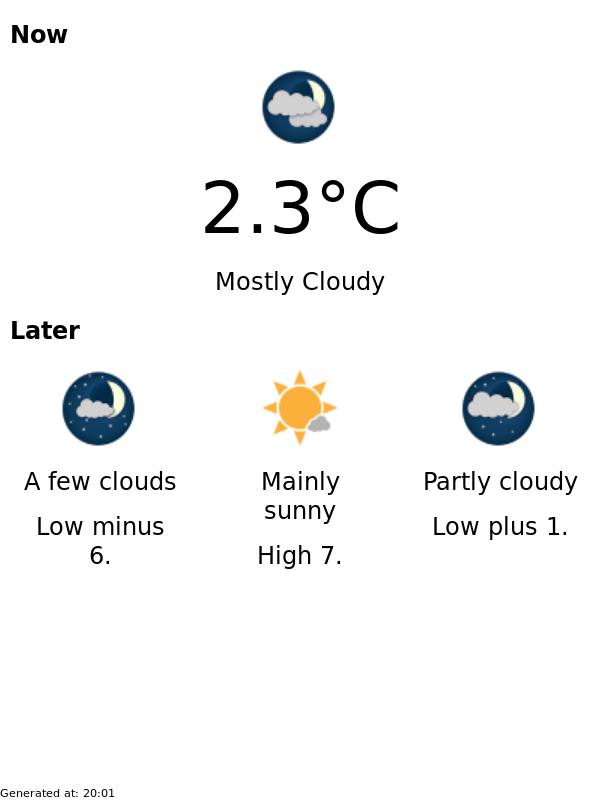

Walter: a friendly ambient display for weather (and hopefully other things) running on a repurposed Kobo

Consists of the kobo-app (to be installed on the kobo) and the server (which serves a webpage / png for the kobo to display)

Instead of learning how to write a qt app, I use the skills I do have (writing html) to write a little python web app that can screenshot itself using firefox

Currently just fetches my local weather from environment canada

## Credits

Big thanks to NiLuJe for fbink, kfmon, and the curl binary